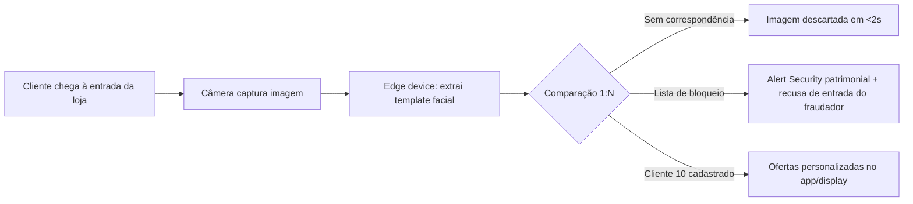

# RIPD-2026-001 · Relatório de Impacto à Proteção de Dados Pessoais

## Operação avaliada: Reconhecimento Facial de clientes na entrada das lojas

> **Enquadramento legal:** Art. 38 da LGPD (relatório de impacto) + Art. 11 (dados biométricos) + Guia Orientativo de RIPD da ANPD.
> **Classificação:** Tratamento de **alto risco** — uso de biometria em larga escala e avaliação automatizada de pessoas.

---

## 1. Informações Gerais

| Campo | Valor |
|---|---|
| **Identificador do RIPD** | RIPD-2026-001 |
| **Nome da operação** | Identificação biométrica facial de clientes do programa "Cliente 10" na entrada das lojas, para prevenção à fraude e personalização de ofertas |
| **Controlador** | Supermercados 10 Comércio de Alimentos Ltda. — CNPJ 12.345.678/0001-90 — Av. Paulista, 1.000, São Paulo/SP |
| **Encarregado (DPO)** | [Nome do Encarregado] — lgpd@supermercado10.com.br — +55 (11) 4000-1010 |
| **Data de elaboração** | 08/08/2026 |
| **Versão / Status** | 1.0 / Aprovado |
| **Responsável pelo preenchimento** | [Nome do Encarregado] com apoio do time de Segurança da Informação |
| **Base legal principal** | Art. 11, II, "g" (prevenção à fraude e segurança em autenticação) + Art. 11, I (consentimento) para personalização |
| **Motivo da elaboração** | Tratamento de dados sensíveis (biométricos) em larga escala — risco elevado (Art. 38; Art. 42) |

---

## 2. Escopo e Descrição do Tratamento

### 2.1 Finalidade

- **(a) Prevenção à fraude e segurança** — identificar clientes que constem da "lista de bloqueio" do programa de fidelidade (histórico de fraudes, devoluções abusivas, reincidência em perda de compra), evitando a reentrada e o prejuízo ao caixa.
- **(b) Personalização de ofertas (consentida)** — reconhecer o "Cliente 10" na entrada e disponibilizar ofertas personalizadas no app e nos displays das lojas.

> **Princípio da finalidade (Art. 6º, I):** as duas finalidades são **específicas, explícitas e legítimas** e estão segregadas em bases legais distintas — ver seção 3.

### 2.2 Categorias de Dados

| Tipo | Dados | Sensível? |
|---|---|---|
| Dados pessoais | Nome, CPF, e-mail, telefone, perfil de compras do programa "Cliente 10" | Não |
| **Dados sensíveis** | **Template biométrico facial (vetor matemático irreversível) e, transitoriamente, a imagem capturada** | **Sim — Art. 5º, II** |
| Crianças/adolescentes | Não há cadastro de menores no programa | Não |

### 2.3 Titulares Afetados

- Clientes do programa "Cliente 10" (estima-se **~180.000 cadastros**, com ~40.000 atendimentos/mês nas 15 lojas).
- Visitantes não cadastrados passam por **comparação 1:N apenas contra a "lista de bloqueio"** (minimização): imagem descartada imediatamente quando sem correspondência.
- Frequência: **contínua** (em cada entrada de loja).

### 2.4 Sistemas e Tecnologias

- Câmeras IP nas entradas das 15 lojas (resolução suficiente para reconhecimento).
- Plataforma de reconhecimento facial do **fornecedor "FaceID BR" (operador)** — comparação 1:N local (edge device por loja) com sincronização de lista de bloqueio via nuvem criptografada.
- ERP/CRM (cadastro "Cliente 10"), app do cliente, display de ofertas.

### 2.5 Compartilhamento e Transferências

| Destinatário | Finalidade | Natureza | Transferência Internacional |
|---|---|---|---|
| Fornecedor "FaceID BR" | Processamento do reconhecimento facial (operador) | Operador | Não (data center em São Paulo/SP) |
| Provedor de nuvem (AWS) | Sincronização da lista de bloqueio e backup criptografado | Operador | Sim — SCCs ANPD (Res. CD/ANPD nº 19/2024) com região us-east-1 para replicação de DR; templates sempre criptografados |
| Autoridade policial | **Somente** mediante ordem judicial (Art. 18, §3º c/c ordem) | — | Não |

> **Nota 2026:** transferências Brasil ↔ UE estão cobertas por adequação mútua (jan/2026). O fluxo com a AWS (EUA) mantém **SCCs da ANPD** e criptografia em repouso/trânsito.

---

## 3. Avaliação de Necessidade e Proporcionalidade

| Pergunta | Resposta | Justificativa |
|---|---|---|
| O tratamento é necessário para a finalidade? | **Sim** | Prevenção à fraude não é viável de forma proporcional sem biometria: cartões e CPF são clonáveis/transferíveis; o rosto é o vínculo mais confiável entre a pessoa física e o histórico fraudulento. |
| Há alternativa com menos dados (Minimização — Art. 6º, III)? | **Parcialmente** | Para **personalização**: sim — substituível por app/token no caixa (alternativa oferecida ao cliente). Para **prevenção à fraude**: não há alternativa equivalente; ainda assim, a imagem é **descartada após extração do template** e a comparação é **local**. |
| O prazo de retenção é proporcional? | **Sim** | Template do fraudador: enquanto constar na lista de bloqueio (renovada a cada 12 meses); template do cliente: enquanto houver consentimento vigente e cadastro ativo. |
| É possível anonimizar/pseudonimizar? | **Sim** | O template é pseudonimizado (ID interno), nunca armazenado com o CPF no mesmo repositório. |
| Os direitos dos titulares (Art. 18) são preservados? | **Sim** | Canal do encarregado permite consulta, revogação de consentimento e exclusão do template; processo documentado na pasta 06. |
| A expectativa razoável do titular é respeitada? | **Sim** | Sinalização na entrada, consentimento específico no cadastro, alternativa sem biometria. |

### 3.1 Teste de Balanceamento (interesse legítimo — Art. 10, §3º)

> **Atenção:** para a finalidade de **prevenção à fraude** com dados biométricos, a base legal é o **Art. 11, II, "g"** (não exige consentimento, mas exige avaliação de risco e de impacto). O balanceamento abaixo é complementar e documenta o juízo de proporcionalidade.

- **Interesse legítimo do controlador:** reduzir fraudes ao caixa (devoluções abusivas, cupons de troca fraudulentos) e proteger o patrimônio, com impacto direto na viabilidade do programa de fidelidade.
- **Impacto sobre direitos e liberdades:** risco de vigilância percebida, erro de correspondência (falso positivo) e exclusão indevida de clientes.
- **Salvaguardas:** revisão humana obrigatória antes de qualquer ação contra o cliente; imagem descartada em <2s sem correspondência; recusa de entrada somente com confirmação manual por segurança patrimonial.
- **Conclusão:** o interesse legítimo **prevalece**, condicionado às salvaguardas da seção 5 e à adoção de alternativa sem biometria para o fluxo de personalização.

---

## 4. Identificação e Avaliação de Riscos

### 4.1 Matriz de Risco (Probabilidade × Impacto)

| Probabilidade \ Impacto | Insignificante | Menor | Moderado | Crítico |
|---|---|---|---|---|
| **Rara** | Baixo | Baixo | Médio | Alto |
| **Possível** | Baixo | Médio | Alto | **Extremo** |
| **Provável** | Médio | Alto | **Extremo** | **Extremo** |
| **Quase certa** | Alto | Alto | **Extremo** | **Extremo** |

### 4.2 Registro de Riscos Identificados

| ID | Cenário / Ameaça | Prob. | Impacto | Nível | Decisão |
|---|---|---|---|---|---|
| R-01 | Vazamento do template biométrico (Art. 48) | Rara | Crítico | **Alto** | Mitigar |
| R-02 | **Falso positivo**: cliente legítimo barrado na entrada por erro de correspondência | Possível | Moderado | **Alto** | Mitigar |
| R-03 | Uso secundário do template (finalidade incompatível — Art. 6º, I e §1º) | Rara | Moderado | Médio | Mitigar |
| R-04 | Perda ou corrupção da lista de bloqueio / indisponibilidade do sistema | Possível | Menor | Médio | Mitigar |
| R-05 | Falta de transparência → perda de confiança e reclamações à ANPD | Possível | Moderado | **Alto** | Mitigar |
| R-06 | Acesso não autorizado interno (funcionário consultando templates) | Rara | Moderado | Médio | Mitigar |
| R-07 | Transferência internacional sem mecanismo válido (AWS) | Rara | Alto | **Alto** | Mitigar |

---

## 5. Plano de Ação e Controles de Mitigação

| ID | Controle Técnico | Controle Administrativo | Risco Residual | Responsável | Prazo |
|---|---|---|---|---|---|
| R-01 | Criptografia em repouso (AES-256) e em trânsito (TLS 1.3); chaves em HSM/KMS; **templates nunca em texto plano** | Política de Segurança da Informação; [[../05-plano-de-resposta-a-incidentes/README|Plano de Resposta a Incidentes]] ativo | Baixo | CISO | Implementado |
| R-02 | Limiar de similaridade conservador (≥0,85) + **confirmação manual obrigatória** (segurança patrimonial) antes de qualquer ação | Procedimento de revisão humana; registro da decisão | Baixo | Operações | Implementado |
| R-03 | Segregação lógica das finalidades (fraude vs. personalização); templates pseudonimizados com ID interno | Cláusula contratual proibindo uso secundário (DPA); auditoria anual | Baixo | DPO | Implementado |
| R-04 | Alta disponibilidade (edge device local funciona offline); backup criptografado da lista | RPO 15min / RTO 2h | Baixo | TI | Implementado |
| R-05 | Sinalização nas entradas; política de privacidade externa; **alternativa sem biometria** (app/cartão no caixa) | [[../04-politicas/politica-privacidade-externa-site|Política de Privacidade externa]] publicada; canal do encarregado | Médio | DPO/Marketing | Implementado |
| R-06 | RBAC: somente segurança patrimonial e DPO acessam a lista; MFA; trilha de auditoria completa | Segregação de funções; treinamento | Baixo | CISO | Implementado |
| R-07 | SCCs ANPD (Res. CD/ANPD nº 19/2024) firmadas com a AWS; avaliação de impacto da transferência | Registro no RoPA | Baixo | DPO/TI | Implementado |

### 5.1 Medidas alinhadas ao Guia ANPD de Reconhecimento Facial

- [x] **Avaliação de impacto** prévia à operação (este RIPD) — exigência do Art. 38 e recomendação explícita da ANPD para biometria facial.
- [x] **Minimização:** imagem descartada após extração do template; comparação 1:N local.
- [x] **Transparência ativa:** sinalização na entrada + consentimento específico para personalização.
- [x] **Revisão humana** antes de qualquer decisão que gere efeito jurídico desfavorável (Art. 20).
- [x] **Alternativa equivalente sem biometria** para quem não consentir (sem prejuízo de atendimento).

### 5.2 Aceite de Risco Residual

| Risco Residual | Nível | Aceite Formal | Data |
|---|---|---|---|
| R-05 (confiança/transparência) | Médio | Diretor de Marketing | 08/08/2026 |

> **Nota:** riscos residuais de nível Médio foram formalmente aceitos pela diretoria da área solicitante, desonerando o Encarregado — prática de accountability (Art. 6º, IX).

---

## 6. Conclusão

### 6.1 Parecer do Encarregado (DPO)

> **PARECER: FAVORÁVEL COM CONDICIONANTES**

O tratamento de reconhecimento facial para **prevenção à fraude** (Art. 11, II, "g") é necessário, proporcional e encontra-se coberto por salvaguardas técnicas e administrativas robustas. Para a finalidade de **personalização de ofertas**, o tratamento somente pode prosseguir com **consentimento específico e destacado** (Art. 11, I), oferta de **alternativa sem biometria** e **revogação imediata** a qualquer momento.

**Condicionantes:**
1. Manter a revisão humana obrigatória antes de qualquer bloqueio de entrada.
2. Renovar a avaliação deste RIPD a cada **12 meses** ou a qualquer alteração do fluxo.
3. Notificar a ANPD (Art. 48) em caso de qualquer incidente envolvendo templates biométricos, ainda que sem risco relevante, por prudência.

[Nome do Encarregado] — Encarregado de Dados (DPO) — 08/08/2026

### 6.2 Aprovação da Gestão

| Papel | Nome | Decisão | Data |
|---|---|---|---|
| Controlador (Diretor-Geral) | [Nome] | Prosseguir com as condicionantes | 08/08/2026 |
| CISO | [Nome] | Prosseguir | 08/08/2026 |
| Diretor de Marketing (Data Owner) | [Nome] | Prosseguir (personalização apenas com consentimento) | 08/08/2026 |

### 6.3 Gatilhos de Revisão

- [ ] Alteração de finalidade ou fluxo do tratamento
- [ ] Mudança de base legal ou de fornecedor de biometria
- [ ] Incidente de segurança relevante (Art. 48)
- [ ] Atualização do Guia de Reconhecimento Facial da ANPD ou nova regulamentação
- [ ] Revisão anual: **08/08/2027**

---

## 7. Referências Normativas

- **LGPD (Lei 13.709/2018):** Art. 5º, II e XIX; Art. 6º; Art. 7º; Art. 10, §3º; Art. 11; Art. 18; Art. 20; Art. 38; Art. 42; Art. 46; Art. 48; Art. 52.
- **ANPD:** Guia Orientativo de RIPD; Guia de Reconhecimento Facial (estudos e Nota Técnica); Res. CD/ANPD nº 2/2022; Res. CD/ANPD nº 15/2024 (incidentes); Res. CD/ANPD nº 19/2024 (SCCs).
- **GDPR (UE 2016/679):** Art. 35 (DPIA); Art. 9, §1º (dados biométricos).
- **ISO/IEC 27701:2019:** Cláusula 7.2.5 — avaliação de impacto na privacidade.
- **ISO/IEC 27005:2022 / ISO 31000:2018:** gestão de riscos.

## Anexos

- [x] Diagrama de fluxo de dados (seção 2.4)
- [ ] Evidências: contrato/DPA com o fornecedor FaceID BR, telas de consentimento, sinalização de loja
- [ ] Relação com o [[ropa-registro-operacoes|RoPA]] e com a [[Github/LGPD/03-lia-teste-de-legitimidade/README|pasta de LIAs]]
