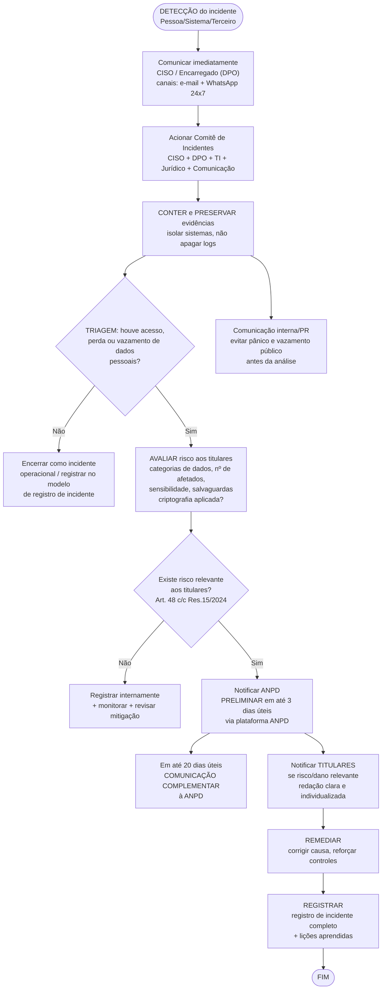

# Fluxograma de Resposta a Incidentes (Art. 48)

> Visão geral de **quem aciona quem** e em quanto tempo, desde a detecção até a notificação à ANPD. O detalhamento passo a passo está no [[playbook-resposta-incidente|Playbook de Resposta a Incidentes]].

## Tempos-chave (LGPD + Res. CD/ANPD nº 15/2024)

| Marco | Prazo |
|---|---|
| **T0 — Detecção** | Comunicação imediata ao CISO/DPO (intra 1h) |
| **T0 + 4h** | Acionamento do Comitê de Incidentes e início da triagem |
| **T0 + 24h** | Decisão preliminar sobre notificação (relevância do risco) |
| **T0 + 72h** | SLA interno de preparação da comunicação (antes do prazo legal) |
| **T0 + 3 dias úteis** | **Notificação preliminar à ANPD** (prazo legal — Res. CD/ANPD nº 15/2024, Art. 5º) |
| **T0 + 20 dias úteis** | **Comunicação complementar à ANPD** (prazo legal — Art. 6º) |
| Imediato (após análise) | Comunicação aos **titulares** quando houver risco/dano relevante |

## Regras de escalonamento

| Critério | Ação |
|---|---|
| Suspeita de vazamento de dados pessoais | Escalonar **sempre** ao DPO, ainda que não confirmado |
| Dados **biométricos, financeiros ou de saúde** envolvidos | Notificar ANPD **mesmo com dúvida** sobre relevância (prudência) |
| Incidente com **e-commerce / pagamento** | Acionar adquirente e avaliar comunicação ao ecossistema PCI |
| Impacto reputacional/da imprensa | Jurídico + Comunicação definem nota pública |
| Evidências de crime | Preservar e acionar autoridade policial (com orientação jurídica) |

## Canais de acionamento

- **CISO / Equipe de Segurança:** `seguranca@supermercado10.com.br` · +55 (11) 99999-0001 (24x7)
- **Encarregado (DPO):** `lgpd@supermercado10.com.br` · +55 (11) 4000-1010
- **Jurídico:** `juridico@supermercado10.com.br`

## Modelos para download

- [[modelo-registro-incidente|Modelo de Registro de Incidente]]
- [[modelo-comunicacao-anpd-titulares|Modelo de Comunicação à ANPD e aos Titulares]]
- [[playbook-resposta-incidente|Playbook completo]]
